<p align="center">
  
</p>

<h1 align="center">Akila Wasalathilaka</h1>

<p align="center">
  
</p>

<p align="center">
  
  &nbsp;
  
  &nbsp;
  <a href="https://www.linkedin.com/in/akila-wasalathilaka">
    
  </a>
  &nbsp;
  
</p>

<p align="center">
  <a href="https://akila.dev">
    
  </a>
</p>

<p align="center">
  <strong>Full-Stack AI Engineer &amp; Security Researcher</strong><br/>
  Crafting intelligent, secure, and high-performance systems across deep learning, computer vision, and proactive threat intelligence.
</p>

<br/>

<!-- ──────────────────────────────────────────────── -->
<p align="center">
  
</p>

## ⚡ Quick Snapshot

<div align="center">

| 🎯 Focus | 🛠 Stack | 🚀 What I Build |
|:---:|:---:|:---:|
| **AI / ML** | PyTorch · TensorFlow · HuggingFace · Scikit-Learn | Vision systems, predictive models, automation pipelines |
| **Backend** | FastAPI · Node.js · Express · Go-Fiber | APIs, secure services, real-time data flows |
| **Frontend / Mobile** | React · Next.js · Android | Clean interfaces, dashboards, mobile experiences |
| **Infra** | Docker · Kubernetes · AWS · PostgreSQL · Redis · GitHub Actions | Scalable deployments, CI/CD, observability |

</div>

<br/>

## 🔭 Featured Work

### 🛡️ PRISM: Threat Intelligence &amp; Risk Assessment
<p>
  <a href="https://prism.akila.dev"></a>
  &nbsp;
  <a href="https://prism.akila.dev/docs"></a>
</p>

PRISM is a proactive threat intelligence and security risk assessment platform that helps identify, analyze, and mitigate cyber threats before they impact infrastructure.

- Proactive threat hunting with automated anomaly detection and traffic classification.
- Real-time risk scoring for faster incident prioritization.
- Interactive dashboards for telemetry, triage, and response workflows.

<details>
<summary>Risk tiers</summary>

- Critical: active exfiltration indicators or anomalous SSH behavior.
- High: repeated failed logins combined with suspicious origin signals.
- Medium: internal scanning or configuration drift.

</details>

<details>
<summary>Quick self-hosting</summary>

```bash
git clone https://github.com/akilaisadev/prism.git
cd prism
make setup
make up
```

</details>

---

### 🛰️ Slum Detection: Satellite Image AI Analyser
<p>
  <a href="https://github.com/akilaisadev/slum-detection/raw/main/paper.pdf"></a>
  &nbsp;
  <a href="https://huggingface.co/akilaisadev/slum-detection-unet"></a>
</p>

An end-to-end semantic segmentation pipeline built with U-Net and a ResNet50 backbone to identify informal settlements in high-resolution satellite imagery.

<details>
<summary>Validation metrics</summary>

| Metric | Score |
|:---|:---:|
| AUC-ROC | 0.942 |
| F1-Score | 0.897 |
| IoU (Slum Class) | 0.814 |
| Precision | 0.912 |
| Recall | 0.883 |

</details>

<details>
<summary>Inference example</summary>

```python
import torch
from slum_detector import SlumDetectorUNet

detector = SlumDetectorUNet.load_from_checkpoint("best_model.ckpt")
detector.eval().to("cuda" if torch.cuda.is_available() else "cpu")

satellite_image = detector.preprocess_image("data/tile_0912.png")
with torch.no_grad():
    prediction_mask = detector(satellite_image)

detector.save_overlay(prediction_mask, "output/slum_overlay.png")
print("Inference completed. Overlay saved to output/slum_overlay.png.")
```

</details>

<br/>

## 🧰 Tech Stack

<p align="center">
  <!-- Languages -->
  
  
  
  
  
  
  <br/>
  <!-- AI/ML -->
  
  
  
  
  
  <br/>
  <!-- Backend -->
  
  
  
  <br/>
  <!-- Frontend -->
  
  
  
  <br/>
  <!-- Infra -->
  
  
  
  
  
  
</p>

<br/>

## 📊 GitHub Stats

<p align="center">
  
  <br/><br/>
  
  <br/><br/>
  
</p>

<br/>

## 🤝 Connect

<p align="center">
  <a href="mailto:akilawasalathilaka@gmail.com">
    
  </a>
  <br/><br/>
  <a href="https://www.linkedin.com/in/akila-wasalathilaka">
    
  </a>
  <br/><br/>
  <a href="https://akila.dev">
    
  </a>
</p>

---

<p align="center">Made with ❤️ by <a href="https://github.com/akilaisadev">Akila Wasalathilaka</a></p>
